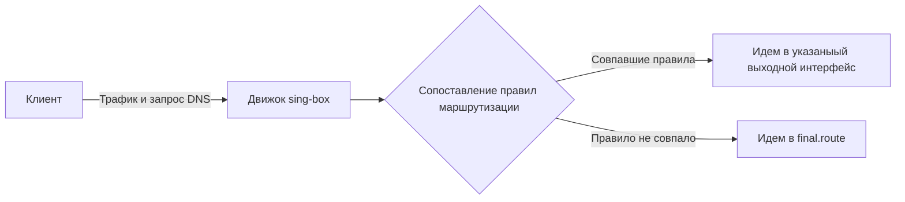

## Основные концепции

Работу с движком sing-box можно схематично представить следующим образом:

Внутри себя sing-box проводит сопоставление правил маршрутизации, осуществляет самостоятельный резолвинг доменов согласно заданным правилам. Более подробно о том как работает этот механика можно прочесть [Документация sing-box](https://sing-box.sagernet.org/manual/proxy/client/)

При этом режим работы Fake-IP существенно отличается от режима TProxy или OpkgTun + политика, тем что трафик в движок sing-box попадает только в том случае, если клиент запросил и получил IP для домена из пула FakeIP-DNS, что означает, что только маршрутизируемый трафик попадет в движок singbox. Режим Fake-IP предназначен для опытных пользователей, понимающих как работает Fake-IP и как его настроить. В общем случае рекомендуется использовать режим OpkgTun + политика.
