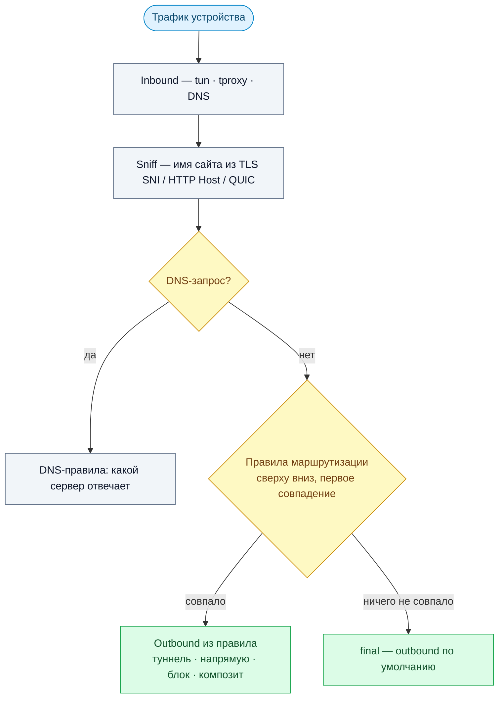
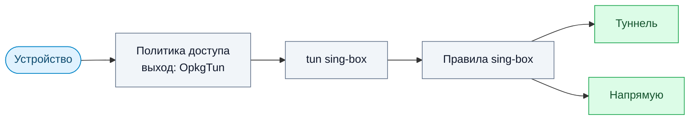
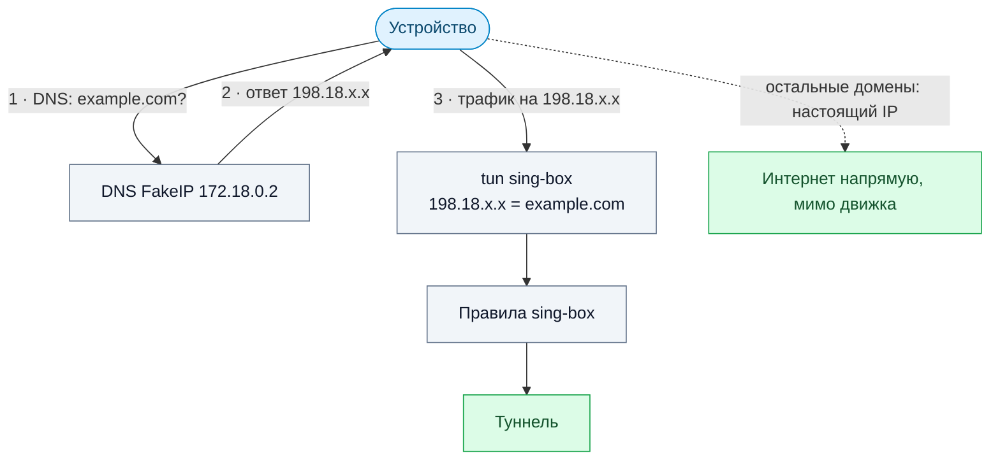

Эта страница объясняет, как awg-manager заводит трафик в sing-box, что с ним происходит внутри движка и почему в качестве движка выбран именно sing-box. Настройка по шагам — в [примере настройки](../router-quickstart/), справочник по интерфейсу — в [Sing-box Маршрутизация](../router/).

## Путь пакета через движок

Какой бы режим ни был выбран, внутри sing-box трафик проходит одни и те же стадии:

```mermaid
%%{init: {'themeVariables': {'fontSize': '16px'}}}%%
flowchart TD
    IN(["Трафик устройства"]) --> INB["Inbound — tun · tproxy · DNS"]
    INB --> SN["Sniff — имя сайта из TLS SNI / HTTP Host / QUIC"]
    SN --> DNS{"DNS-запрос?"}
    DNS -- да --> DR["DNS-правила: какой сервер отвечает"]
    DNS -- нет --> RR{"Правила маршрутизации<br/>сверху вниз, первое совпадение"}
    RR -- совпало --> OUT["Outbound из правила<br/>туннель · напрямую · блок · композит"]
    RR -- ничего не совпало --> FIN["final — outbound по умолчанию"]

    classDef io fill:#e0f2fe,stroke:#0284c7,color:#0c4a6e;
    classDef step fill:#f1f5f9,stroke:#64748b,color:#0f172a;
    classDef decide fill:#fef9c3,stroke:#ca8a04,color:#713f12;
    classDef out fill:#dcfce7,stroke:#16a34a,color:#14532d;
    class IN io;
    class INB,SN,DR step;
    class DNS,RR decide;
    class OUT,FIN out;
```

1. **Inbound** — точка входа. Какой именно, зависит от [режима](#как-трафик-попадает-в-движок): tun-интерфейс, перехват TPROXY или DNS-сервер FakeIP.
2. **Sniff** — анализ первых байтов соединения. sing-box достаёт из него имя сайта (TLS SNI, HTTP Host, QUIC), поэтому доменные правила работают даже тогда, когда устройство обратилось по IP.
3. **DNS** — запросы устройств перехватываются (`hijack-dns`) и обрабатываются встроенным резолвером по [DNS-правилам](#dns).
4. **Правила маршрутизации** — проверяются сверху вниз, срабатывает **первое** подходящее, дальше проверка не идёт.
5. **Outbound** — куда уходит соединение: туннель, **Напрямую**, **Заблокировать** или [композит](#словарь). Если ни одно правило не совпало, соединение уходит в **final**.

## Как трафик попадает в движок

awg-manager умеет три способа завести трафик в sing-box. Внутри движка они работают одинаково — отличаются тем, **чей** трафик и **каким путём** до него доходит.

| | **Политики + tun** | **TProxy** | **FakeIP** |
|---|---|---|---|
| Как перехватывается | интерфейс OpkgTun как выход политики доступа Keenetic | правила netfilter (TPROXY) без изменения адресов | DNS sing-box выдаёт адреса из пула, трафик к ним идёт в tun |
| Чей трафик попадает | весь трафик устройств в выбранной политике | устройства политики или весь роутер | только трафик к доменам, для которых выдан fake-адрес |
| Кто решает, кого пускать | политики доступа Keenetic | настройки источника в движке | DNS-правила FakeIP |
| Что нужно | KeeneticOS 5.x | компонент **Netfilter** | KeeneticOS 5.x, устройство использует DNS `172.18.0.2` |
| Нагрузка на CPU | весь трафик политики проходит через стек tun | весь перехваченный трафик | только нужный трафик |
| Когда выбирать | **по умолчанию** — надёжнее всего, стабильный UDP | нужен перехват без tun-интерфейса | нужно завернуть лишь отдельные домены и не пропускать через движок остальное |

### Политики + tun

```mermaid
%%{init: {'themeVariables': {'fontSize': '16px'}}}%%
flowchart LR
    D(["Устройство"]) --> P["Политика доступа<br/>выход: OpkgTun"]
    P --> T["tun sing-box"]
    T --> E["Правила sing-box"]
    E --> O1["Туннель"]
    E --> O2["Напрямую"]

    classDef io fill:#e0f2fe,stroke:#0284c7,color:#0c4a6e;
    classDef step fill:#f1f5f9,stroke:#64748b,color:#0f172a;
    classDef out fill:#dcfce7,stroke:#16a34a,color:#14532d;
    class D io;
    class P,T,E step;
    class O1,O2 out;
```

awg-manager поднимает интерфейс OpkgTun и регистрирует его в роутере как обычное подключение с маршрутом по умолчанию. Дальше выбор делает сам Keenetic: устройства, чья политика доступа выходит через этот интерфейс, отправляют **весь** свой трафик в sing-box, а он уже раскладывает его по правилам. Перехвата netfilter и подмены адресов здесь нет. Kill-switch получается сам собой: если в политике разрешён только этот интерфейс, при остановленном sing-box устройство остаётся без сети.

Рекомендуемый режим с sing-box 1.15: он надёжнее остальных, лучше держит UDP и достаточно быстр даже на MIPSEL-роутерах благодаря [стеку sing-tun](#сетевой-стек-tun).

### TProxy

Правила netfilter перехватывают соединения устройств и передают их sing-box **без изменения адресов** — движок видит настоящие адрес назначения и порт. Источник выбирается в настройках движка: устройства, привязанные к политике, или весь роутер. Трафик можно исключать из перехвата по портам, подсетям и GeoIP. Нужен системный компонент **Модули ядра подсистемы Netfilter**.

### FakeIP

```mermaid
%%{init: {'themeVariables': {'fontSize': '16px'}}}%%
flowchart TD
    D(["Устройство"]) -- "1 · DNS: example.com?" --> F["DNS FakeIP 172.18.0.2"]
    F -- "2 · ответ 198.18.x.x" --> D
    D -- "3 · трафик на 198.18.x.x" --> T["tun sing-box<br/>198.18.x.x = example.com"]
    T --> E["Правила sing-box"] --> O["Туннель"]
    D -. "остальные домены: настоящий IP" .-> W["Интернет напрямую, мимо движка"]

    classDef io fill:#e0f2fe,stroke:#0284c7,color:#0c4a6e;
    classDef step fill:#f1f5f9,stroke:#64748b,color:#0f172a;
    classDef out fill:#dcfce7,stroke:#16a34a,color:#14532d;
    class D io;
    class F,T,E step;
    class O,W out;
```

sing-box сам работает DNS-сервером. На домены из DNS-правил FakeIP он отвечает синтетическими адресами из пула (по умолчанию `198.18.0.0/15`) и запоминает соответствие «адрес ↔ домен». Трафик к таким адресам маршрутизируется в tun sing-box, и движок по адресу узнаёт домен. На остальные домены отвечают настоящие адреса — этот трафик идёт мимо движка и не нагружает его.

Условия и ограничения:

- устройство должно использовать DNS `172.18.0.2` (задаётся на устройстве, через DHCP сегмента или как единственный DNS роутера);
- устройства с собственным DoH/DoT резолвят мимо FakeIP, и их трафик в туннель не попадёт;
- в DNS-правилах FakeIP стоит указывать только те наборы, которые действительно нужно заворачивать: всё остальное тогда вообще не касается движка.

## Правила

- **Порядок важен.** Правила проверяются сверху вниз, срабатывает первое совпадение. Системные правила (sniff, перехват DNS, локальная сеть напрямую) стоят первыми — свои правила ставьте ниже них.
- **final** — outbound для всего, что не совпало ни с одним правилом. По умолчанию `direct`, то есть мимо VPN.
- **Rule set** — переиспользуемый набор условий: `remote` (sing-box скачивает `.srs` по URL и обновляет), `local` (файл на роутере), `inline` (прямо в конфиге); быстрые типы **Geosite** и **GeoIP**. Если источник набора заблокирован, скачивание можно пустить через туннель (`download detour`).
- **Доменные правила и SNI.** Имя сайта берётся из sniff. Где имени не видно — ECH, не-HTTP-протоколы, — соединение маршрутизируется только по IP.
- **Действия:** туннель или композит, **Напрямую**, **Заблокировать** (`reject`).

## DNS

- **Перехват** (`hijack-dns`) — запросы устройств на порт 53 обрабатывает резолвер sing-box. Устройства с DoH/DoT перехват обходят.
- **DNS-серверы** — апстримы UDP / TLS / HTTPS, сервер по умолчанию. Сервер может ходить через туннель (`detour`).
- **DNS-правила** выбирают сервер для домена или набора. С sing-box 1.14 у правила четыре действия — **Маршрут**, **Блокировка**, **Evaluate** (запомнить ответ и продолжить цепочку) и **Respond** (вернуть запомненный ответ); подробно — в [справочнике по DNS](../router/#dns).
- **DNS Rewrite** — принудительный ответ для домена или маски.

## Сетевой стек tun

В режимах с tun-интерфейсом (Политики + tun и FakeIP) sing-box получает от ядра сырые IP-пакеты и сам собирает из них TCP-соединения и UDP-сессии. Этим занимается **сетевой стек** — от его эффективности напрямую зависят скорость и нагрузка на процессор роутера.

| Стек | Статус |
|---|---|
| **sing-tun** | по умолчанию с sing-box 1.15 — собственный стек sing-box, без gVisor и без системного стека |
| **system** | устаревший, оставлен как аварийный откат; sing-box удалит его в 1.17 |
| gVisor, mixed | из сборки awg-manager убраны; сохранённый выбор при старте заменяется на sing-tun |

Стек выбирается в настройках движка и один на оба tun-режима. При переходе с gVisor на sing-tun на Keenetic Ultra (MT7621) скорость TCP выросла с 24 до 230 Мбит/с при вдвое меньшей загрузке процессора, а UDP перестал упираться в 13 Мбит/с.

## Почему sing-box, а не mihomo

mihomo — другой популярный прокси-движок с похожими возможностями. У него есть собственный сетевой стек `mips` (Mihomo IP Stack). Ниже результаты сравнения работы стеков.

**Стенд:** Keenetic Ultra KN-1810 (MT7621, 4 потока, 254 МБ RAM), ядро 4.9, KeeneticOS 5.2 Alpha 11, 29.09.2026. Трафик проходил tun → стек движка → напрямую → приёмник на том же роутере. Генератор нагрузки и движок делят один процессор, поэтому абсолютные цифры занижены, но условия у всех вариантов одинаковые.

| Движок / стек | TCP, Мбит/с (1 / 4 потока) | CPU-с на 1 ГБ (TCP) | Потолок UDP, Мбит/с | CPU-с на 1 ГБ (UDP) | Память, МБ |
|---|---|---|---|---|---|
| **sing-box `sing-tun`** | **212 / 225** | **~51** | **~50** | **~204** | 42–46 |
| mihomo `mips` | 34 / 42 | ~670 | ~14 | ~1250 | 41–43 |
| mihomo `mips` + GSO | 32 / 41 | ~680 | ~14 | ~1290 | 48–52 |
| mihomo `system` | не замерено | — | ~14–15 | ~1280 | 38–40 |
| mihomo `gvisor` | 7 / 7 | ~3000 | ~4 | ~4500 | 42–46 |

«CPU-с на 1 ГБ» — сколько процессорного времени уходит на передачу гигабайта: чем меньше, тем меньше движок нагружает роутер при той же скорости.

**Что показал замер:**

- **TCP:** sing-box быстрее mihomo с лучшим стеком примерно в **6 раз** и тратит на тот же объём в **12–13 раз** меньше процессорного времени.
- **UDP:** потолок у sing-box в **3.5 раза** выше при примерно в 6 раз меньших затратах CPU на гигабайт. У mihomo потолок ~14 Мбит/с одинаков для стеков `mips` и `system` — упор в UDP-обработке самого mihomo, а не в стеке.
- **Память** у движков сопоставима.
- Стек `mips` у mihomo лучше его же `gvisor` (в ~5 раз по TCP), а GSO на ядре 4.9 выигрыша не даёт.

Для роутеров, где один и тот же процессор занят и маршрутизацией, и шифрованием туннелей, разница в затратах CPU решающая: sing-box оставляет роутеру заметно больше ресурсов при той же скорости.

## Словарь

| Термин | Что это |
|---|---|
| **Inbound** | точка входа трафика в sing-box: tun, TPROXY, DNS-сервер |
| **Outbound** | выход: туннель, композит или `direct` (напрямую); блокировка делается действием правила `reject` |
| **Композит** | outbound из нескольких: `selector` — выбранный вручную участник, `urltest` — самый быстрый по замеру задержки |
| **Правило** | условия (домены, IP, порты, наборы, источник) и действие |
| **Rule set** | переиспользуемый набор условий: remote, local, inline, Geosite, GeoIP |
| **final** | outbound для трафика, не совпавшего ни с одним правилом |
| **Sniff** | определение протокола и имени сайта по первым байтам соединения |
| **hijack-dns** | перехват DNS-запросов устройств резолвером sing-box |
| **Пул FakeIP** | диапазон синтетических адресов (`198.18.0.0/15`), которые FakeIP выдаёт вместо настоящих |
| **detour** | через какой outbound ходит сам sing-box: DNS-сервер, скачивание наборов |
| **OpkgTun** | интерфейс Keenetic, через который tun sing-box виден роутеру и политикам доступа |
| **Стек** | часть движка, которая собирает соединения из IP-пакетов tun-интерфейса |

Подробнее о внутреннем устройстве — в [документации sing-box](https://sing-box.sagernet.org/manual/proxy/client/).
